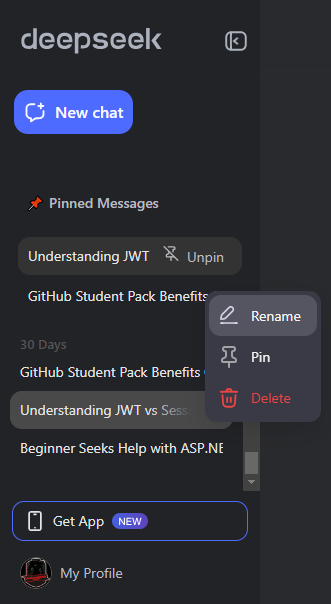
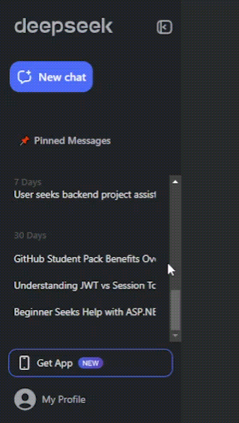

# Chrome Extension: Pin Chats in Deepseek

📝 **Project Overview**: Have a lot of chats and don't want to keep looking for them? Pin them with this Chrome extension! This extension allows you to easily pin your important chats in Deepseek, making them easily accessible and saving you time. Built with simplicity and functionality in mind, this extension enhances your chat management experience.

If you find this repository useful, feel free to fork it and give it a star ⭐.

<div align="center">
  
  
  
  
  <a>
    
  </a>
</div>

## Table of Contents

- [🖼️ Screenshots](#screenshots)
- [📹 GIF Demo](#gif-demo)
- [💻 Technologies](#technologies)
- [⚙️ Installation](#installation)
- [📜 License](#license)

## Screenshots



_The extension in action, showing pinned chats for easy access._

## GIF Demo



_A quick demo of how the extension works._

## Features

✨ **Key Features**:

- Pin important chats for quick access
- Simple and intuitive user interface
- Lightweight and easy to use
- Works seamlessly with Deepseek

## Technologies

🛠️ **Built With**:

- **HTML5**
- **CSS3**
- **JavaScript**

## Installation

1. **📥 Clone the repository**:

   ```bash
   git clone https://github.com/shadowxdgamer/Pin-Chats-Extension.git
   cd Pin-Chats-Extension

   ```

2. **🛠️ Load the extension in Chrome**:

Open Chrome and go to chrome://extensions/.

Enable "Developer mode" in the top right corner.

Click "Load unpacked" and select the cloned repository folder.

3. **🚀 Start using the extension**:

Navigate to Deepseek and start pinning your chats!

## 📄 License

This project is licensed under the MIT License.

##
Feel free to contribute, report issues, or suggest new features! Happy pinning! 📌
